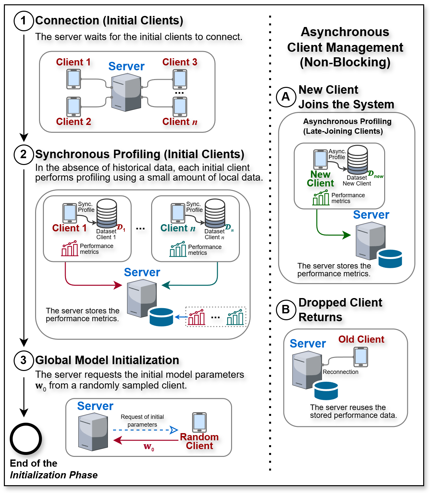
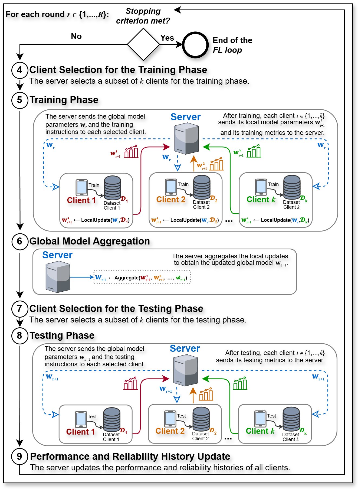

# MetaCS-FL

**MetaCS-FL** is a metaheuristic-based client selection framework for Federated Learning (FL) systems. It targets heterogeneous Cross-Device FL scenarios, where clients may differ in computational capacity, energy behavior, communication performance, availability, data quantity, and data distribution.

The framework models client selection not only as the choice of which clients participate in a federated round, but also as a task-allocation problem: selected clients may receive different local data workloads according to system, energy, fairness, and learning objectives.

MetaCS-FL supports:

- cold-start profiling and history-based performance estimation;
- synchronous FL with asynchronous profiling of late-joining clients;
- intermittent availability, reconnection, and profile reuse;
- reliability-aware client selection and workload allocation;
- time-, energy-, fairness-, data-distribution-, and learning-aware scheduling;
- privacy-preserving disclosure of local class distributions through Differential Privacy;
- configurable, event-driven client-selection triggers and selection reuse;
- metaheuristic refinement (currently implemented with Large Neighborhood Search);
- distributed execution with Flower;
- Grid'5000 and generic remote execution;
- campaign generation, resumption, output merging, and analysis for reproducible experiments.

---

## Table of contents

- [Framework capabilities](#framework-capabilities)
  - [System model and operating assumptions](#system-model-and-operating-assumptions)
  - [Initialization and client profiling](#initialization-and-client-profiling)
  - [Federated learning loop](#federated-learning-loop)
  - [Client selection and workload assignment](#client-selection-and-workload-assignment)
  - [Performance and energy modeling](#performance-and-energy-modeling)
  - [Multi-objective optimization](#multi-objective-optimization)
  - [Reliability and dynamic availability](#reliability-and-dynamic-availability)
  - [Privacy-preserving data-distribution awareness](#privacy-preserving-data-distribution-awareness)
  - [Event-driven optimization and solution reuse](#event-driven-optimization-and-solution-reuse)
  - [Distributed execution and reproducibility](#distributed-execution-and-reproducibility)
- [Reproducing published experiments](#reproducing-published-experiments)
  - [FGCS 2026 experiments](#fgcs-2026-experiments)
  - [ICPADS 2026 experiments](#icpads-2026-experiments)
- [Recommended execution order](#recommended-execution-order)
- [Requirements](#requirements)
  - [Python environment](#python-environment)
  - [System packages](#system-packages)
  - [Energy measurement notes](#energy-measurement-notes)
- [1. Configure the node file](#1-configure-the-node-file)
- [2. Install/setup remote nodes](#2-installsetup-remote-nodes)
- [3. Run toy smoke experiments](#3-run-toy-smoke-experiments)
- [4. Smoke test decision](#4-smoke-test-decision)
  - [4.1 If the smoke test fails: inspect logs and fix environment/configs](#41-if-the-smoke-test-fails-inspect-logs-and-fix-environmentconfigs)
    - [Check for out-of-memory (OOM) kills](#check-for-out-of-memory-oom-kills)
  - [4.2 If the smoke test passes: continue to the experiment campaign](#42-if-the-smoke-test-passes-continue-to-the-experiment-campaign)
- [5. Generate or run the experiment campaign](#5-generate-or-run-the-experiment-campaign)
  - [5.1 Publication campaign inputs](#51-publication-campaign-inputs)
  - [5.2 Generate the FGCS 2026 pack](#52-generate-the-fgcs-2026-pack)
  - [5.3 Generate the ICPADS 2026 manifests](#53-generate-the-icpads-2026-manifests)
  - [5.4 Dry-run the FGCS 2026 pack](#54-dry-run-the-fgcs-2026-pack)
  - [5.5 Dry-run the ICPADS 2026 campaign](#55-dry-run-the-icpads-2026-campaign)
  - [5.6 Run many experiments as a campaign](#56-run-many-experiments-as-a-campaign)
  - [5.7 Resume a campaign](#57-resume-a-campaign)
- [6. Merge distributed outputs](#6-merge-distributed-outputs)
- [7. Run analysis scripts](#7-run-analysis-scripts)
  - [7.1 FGCS 2026: DP impact analysis](#71-fgcs-2026-dp-impact-analysis)
  - [7.2 FGCS 2026: static performance plots](#72-fgcs-2026-static-performance-plots)
  - [7.3 ICPADS 2026: intermittent-availability plots](#73-icpads-2026-intermittent-availability-plots)
  - [7.4 ICPADS 2026: late-joining plots](#74-icpads-2026-late-joining-plots)
  - [7.5 FGCS 2026: scalability analysis](#75-fgcs-2026-scalability-analysis)
  - [7.6 FGCS 2026: static performance summary](#76-fgcs-2026-static-performance-summary)
  - [7.7 ICPADS 2026: intermittent-availability summary](#77-icpads-2026-intermittent-availability-summary)
  - [7.8 ICPADS 2026: late-joining summary](#78-icpads-2026-late-joining-summary)
- [8. Export plots, tables, and metrics](#8-export-plots-tables-and-metrics)
- [Optional execution modes](#optional-execution-modes)
  - [Run one distributed experiment](#run-one-distributed-experiment)
  - [Run server-only experiments](#run-server-only-experiments)
  - [Launch distributed Flower directly](#launch-distributed-flower-directly)
- [Quick command summary](#quick-command-summary)
  - [Select the publication release](#select-the-publication-release)
  - [Setup](#setup)
  - [Smoke test](#smoke-test)
  - [Generate the FGCS 2026 manifest](#generate-the-fgcs-2026-manifest)
  - [Generate the ICPADS 2026 manifests — quick reference](#generate-the-icpads-2026-manifests-quick-reference)
  - [FGCS 2026 dry-run](#fgcs-2026-dry-run)
  - [ICPADS 2026 dry-run](#icpads-2026-dry-run)
  - [FGCS 2026 full campaign](#fgcs-2026-full-campaign)
  - [ICPADS 2026 full campaign](#icpads-2026-full-campaign)
  - [Resume a campaign — quick reference](#resume-a-campaign-quick-reference)
- [Notes for Grid'5000](#notes-for-grid5000)
- [Results](#results)
  - [FGCS 2026](#fgcs-2026)
  - [ICPADS 2026](#icpads-2026)
  - [Thesis](#thesis)
- [Scientific Productions](#scientific-productions)
  - [1. MetaCS-FL: A Metaheuristic-Based Framework for Client Selection in Federated Learning Systems](#1-metacs-fl-a-metaheuristic-based-framework-for-client-selection-in-federated-learning-systems)
  - [2. A Reliability-Aware Client Selection Framework for Federated Learning on Heterogeneous Resources under Dynamic Availability](#2-a-reliability-aware-client-selection-framework-for-federated-learning-on-heterogeneous-resources-under-dynamic-availability)
- [License](#license)

---

## Framework capabilities

MetaCS-FL is more than a client-ranking mechanism. It treats each training or testing phase as a **joint client-selection and workload-allocation problem**. The server decides both which clients should participate and how many local data slices each selected client should process. This allows a round to account simultaneously for resource heterogeneity, communication cost, energy use, deadline constraints, participation history, data distribution, learning behavior, and changing client availability.

### System model and operating assumptions

The framework targets **synchronous, centrally coordinated Cross-Device FL**. An execution has two main stages: an initialization phase and a repeated FL loop. The global model is coordinated by a central server, while raw training and testing data remain on the clients.

The system model supports clients with heterogeneous:

- processing capacity and local execution time;
- download and upload performance;
- computation, communication, and total energy consumption;
- local dataset size and supported workload capacities;
- class distributions and degrees of non-IID data;
- participation histories and observed model utility;
- availability, completion behavior, and connection time.

Clients may disconnect temporarily, return later, or join after training has already started. The FL rounds remain synchronous; only the profiling and admission of late-joining clients occur asynchronously.

> The current system model assumes a trusted server and honest clients. MetaCS-FL does not currently model Byzantine clients, poisoned updates, falsified profiles, or maliciously reported statistics. Differential Privacy is applied to disclosed class histograms, not to the complete training pipeline or model updates.

### Initialization and client profiling

<p align="center">
  
</p>

<p align="center"><em>MetaCS-FL initialization phase: initial connection, synchronous cold-start profiling, global-model initialization, asynchronous profiling of late joiners, and profile reuse for returning clients.</em></p>

The initialization phase establishes the information required for resource-aware selection:

1. **Initial connection.** The server waits until the configured minimum number of clients is connected.
2. **Cold-start profiling.** When no usable historical records exist, the initial clients synchronously profile a small local workload. The resulting measurements describe execution time, energy consumption, and communication behavior and are stored as fallback estimates.
3. **Global-model initialization.** The server obtains the initial model parameters from a sampled client and initializes the global model.
4. **Asynchronous late-join profiling.** Clients that connect after the initial group are profiled without blocking the ongoing FL loop. They become eligible for later rounds once their profiles are complete.
5. **Returning-client profile reuse.** A temporarily disconnected client can reuse its stored profile after reconnecting, unless the configuration requires a refresh.

Synchronous cold-start profiling lies on the initialization critical path and is therefore bounded by the slowest initial client. In contrast, late-join profiling runs outside the current round's critical path.

### Federated learning loop

<p align="center">
  
</p>

<p align="center"><em>MetaCS-FL federated learning loop: selection, local training, aggregation, distributed evaluation, and history updates.</em></p>

For every communication round, the server evaluates the stopping criterion and, while training should continue, performs the following workflow:

1. **Training selection.** MetaCS-FL chooses eligible clients and assigns a workload to each selected client using the available profiles and historical records.
2. **Local training.** The server sends the current global model and client-specific instructions. Selected clients train on their assigned local data slices and return model parameters and training metrics.
3. **Aggregation.** The server aggregates the completed local updates into the next global model.
4. **Testing selection.** MetaCS-FL may independently choose clients and workloads for distributed model evaluation.
5. **Local testing.** Selected clients evaluate the new global model on local data and return testing metrics.
6. **History update.** The server records completion status, execution measurements, energy measurements, losses, participation, availability, and reliability information for future selections.

The selection mechanism can therefore operate in both the training and testing phases, and it can produce different client sets or workload assignments for each phase.

### Client selection and workload assignment

Let the configured workload contain `t` tasks, where each task represents a slice of local data used to form mini-batches for training or testing. For every eligible client `i`, MetaCS-FL maintains a set of valid task capacities. A schedule is represented as:

```text
X = (x_1, x_2, ..., x_n)
```

where `x_i` is the number of tasks assigned to client `i`. An assignment of `x_i = 0` means that the client is not selected.

This formulation allows MetaCS-FL to:

- select only a subset of the available clients;
- assign unequal workloads to heterogeneous clients;
- keep assignments within each client's valid local-data capacities;
- account for different task capacities in training and testing;
- satisfy a configured total workload rather than forcing equal participation;
- adapt assignments as reliability, availability, profiles, or data conditions change.

Consequently, a fast and energy-efficient client may receive more tasks, while a slower, less reliable, or resource-constrained client may remain eligible but receive a smaller workload.

### Performance and energy modeling

For each candidate workload, MetaCS-FL estimates the time required by a client as the sum of:

```text
client time = download time + computation time + upload time
```

The corresponding energy estimate is calculated component by component from elapsed time and mean power:

```text
client energy = download energy + computation energy + upload energy
```

The optimization model uses two system-level quantities:

- **makespan:** the completion time of the slowest selected client, representing the duration of the synchronous phase;
- **total energy consumption:** the sum of the energy consumed by all selected clients.

Both training and testing costs include client-side computation and client-server communication. A user-defined deadline can constrain the maximum admissible makespan. Global aggregation and server-side history bookkeeping are treated as lightweight server operations and are not included in the client time and energy model.

### Multi-objective optimization

MetaCS-FL evaluates candidate schedules through a configurable weighted objective:

```math
\min_{\mathcal{X}} F(\mathcal{X})
=
w_1 M_r + w_2 \Sigma_r
- w_3 D_r - w_4 K_r - w_5 U_r
```

The components are:

| Component | Optimization direction | Purpose |
|---|---:|---|
| Makespan $M_r$ | Minimize | Reduce the duration of the synchronous training or testing phase. |
| Total energy $\Sigma_r$ | Minimize | Reduce aggregate client energy consumption. |
| Client diversity $D_r$ | Maximize | Encourage balanced participation over recent rounds instead of repeatedly choosing the same clients. |
| Class-distribution score $K_r$ | Maximize | Improve class coverage while reducing imbalance in the assigned workload. |
| Utility score $U_r$ | Maximize | Prefer assignments associated with stronger recent training behavior and local generalization. |

The weights `w_1` through `w_5` let an experiment emphasize one objective, combine several objectives, or disable selected components. Time and energy are normalized before scalarization so that their physical units and scale differences do not dominate the remaining scores.

Every solution must satisfy three principal constraints:

- the phase makespan must not exceed the optional deadline;
- the sum of all assigned tasks must equal the configured workload;
- each assignment must belong to the client's current reliability-adjusted capacity set.

### Reliability and dynamic availability

MetaCS-FL maintains a server-side reliability score in `[0, 1]` for every client that has joined the system. New clients start with full reliability because no negative history exists. Before each selection, the score is updated from the previous score and the most recent observed behavior using an exponentially weighted moving average.

The framework distinguishes between:

- **availability failure:** a previously joined client is unavailable before selection;
- **completion failure:** a selected client does not finish its assigned processing;
- **successful behavior:** a client remains available or completes its assigned workload;
- **neutral behavior:** a client is available but not selected.

Availability and completion penalties are independently configurable, with completion failure normally receiving the stronger penalty because it can directly compromise a synchronous round.

Reliability affects **how much work a client may receive**, not only whether it is selected. Lower reliability restricts the set of admissible workload capacities while keeping the client eligible. If these restrictions make the total workload infeasible, the framework can progressively restore valid capacities from the least penalized available clients until a feasible schedule exists.

This mechanism supports both dynamic scenarios studied in the repository:

- **intermittent availability:** clients repeatedly become unavailable and later reconnect;
- **late joining:** new clients enter after the initial FL rounds and become selectable after asynchronous profiling.

### Privacy-preserving data-distribution awareness

To reason about non-IID data without collecting raw samples, MetaCS-FL can request a class histogram for each client's local training and testing splits. The client constructs the histogram locally and applies the Laplace mechanism before disclosure. The privacy parameter `epsilon` controls the amount of noise.

The noisy counts are clipped to non-negative values, rounded, sent to the server, and cached. Because the histograms are produced when a client connects and can be reused across rounds, the framework avoids repeatedly querying intermittently available devices.

These approximate statistics enable two data-aware objectives:

- **class coverage:** how much of the available data for each class is represented by the assignment;
- **class balance:** how closely the assigned workload approaches an even distribution across classes.

The disclosed histograms are intentionally approximate. Noise can create a positive reported count for a class that is absent locally, especially under stronger privacy settings or small local datasets.

### Event-driven optimization and solution reuse

MetaCS-FL is event-driven rather than forced to recompute a selection in every phase of every round. At each selection point, the server:

1. updates the eligible-client set;
2. incorporates newly completed profiles from late joiners;
3. updates reliability-aware capacities;
4. evaluates configurable selection triggers;
5. either runs a new optimization or reuses historical decisions.

When no new selection is required, the most recent selected clients and assignments are retrieved directly. When a new selection is required but the candidate-client set is unchanged, the previous initial solution can be reused. A new initial solution is generated only when necessary, such as after a change in the available candidate set.

In the current implementation:

- **ECMTC** generates a deadline-feasible, energy-first initial schedule;
- **Large Neighborhood Search (LNS)** refines the initial schedule according to the configured multi-objective function;
- the search can stop after a time limit or iteration limit;
- the best schedule is decoded into the selected client set and per-client task assignments.

The framework is structured to support alternative initial-solution methods and metaheuristics, while LNS is the metaheuristic currently implemented and evaluated in this repository.

Selection reuse reduces control-plane overhead. With direct access to stored history, retrieving an unchanged selection is constant-time, while a complete reselection includes both initial-solution generation and metaheuristic evaluation.

### Distributed execution and reproducibility

Beyond the selection algorithm, the repository provides the infrastructure needed to execute and analyze complete FL campaigns:

- Flower-based distributed server and client execution;
- one-command remote-node setup;
- Grid'5000 and generic SSH-based deployment;
- local toy smoke experiments before large campaigns;
- distributed, server-only, and direct-launch execution modes;
- static, intermittent-availability, and late-joining experiment configurations;
- campaign-manifest generation, dry runs, status tracking, and resumption;
- runtime configuration patching and execution-block selection;
- merging of outputs produced across distributed nodes;
- plotting, numerical summaries, LaTeX tables, CSV exports, and scalability analysis;
- frozen release tags and archived result sets for the published experiments.

Together, these components make MetaCS-FL both an optimization framework and an end-to-end experimental platform for studying resource-aware, learning-aware, and reliability-aware client selection under heterogeneous and dynamic FL conditions.

---

## Reproducing published experiments

This repository may evolve over time as the project receives improvements, fixes, and new features. The `main` branch is stable, but it will continue to evolve after each publication. Therefore, for exact reproducibility of published experiments, use the frozen release tag associated with the corresponding publication instead of relying on the default branch.

| Publication | Release tag | Experiment scope | Campaign input |
|---|---|---|---|
| FGCS 2026 | `v0.2.0` | Static client availability: performance, differential-privacy impact, scalability, and sensitivity | Generated `fgcs_2026_experiments` pack |
| ICPADS 2026 | `v0.3.0` | Dynamic client availability: intermittent availability and late-joining clients | Generated combined and family-specific CSV manifests |

### FGCS 2026 experiments

To reproduce the experiments reported in the FGCS 2026 paper, use the frozen release tag `v0.2.0`:

```bash
git clone https://github.com/alan-lira/metacs-fl.git
cd metacs-fl
git checkout v0.2.0
```

When using the remote/Grid'5000 setup script, pass:

```bash
--branch v0.2.0
```

The FGCS 2026 campaign is generated from the pack:

```txt
fgcs_2026_experiments
```

It covers the selected static experiment families under:

```txt
experiments/static_client_availability/
├── performance_experiments/
├── dp_impact_experiments/
├── scalability_experiments/
└── sensitivity_experiments/
```

See [Generate the FGCS 2026 pack](#52-generate-the-fgcs-2026-pack), [run the FGCS campaign](#56-run-many-experiments-as-a-campaign), and download the archived outputs from [FGCS 2026 results](#fgcs-2026).

### ICPADS 2026 experiments

To reproduce the experiments reported in the ICPADS 2026 paper, use the frozen release tag `v0.3.0`:

```bash
git clone https://github.com/alan-lira/metacs-fl.git
cd metacs-fl
git checkout v0.3.0
```

When using the remote/Grid'5000 setup script, pass:

```bash
--branch v0.3.0
```

The ICPADS 2026 evaluation uses both dynamic client-availability families:

```txt
experiments/dynamic_client_availability/
├── intermittent_client_availability_experiments/
└── late_joining_clients_experiments/
```

The intermittent-availability experiments evaluate approaches under changing client-presence scenarios. The late-joining experiments evaluate populations in which a configured number of clients enter after training has begun, with entry-round and client-performance variants defined by execution blocks inside the executor configurations.

For complete coverage, generate the combined manifest:

```txt
campaign_manifests/icpads_2026_experiments.csv
```

The same generator also produces family-specific manifests:

```txt
campaign_manifests/icpads_2026_intermittent.csv
campaign_manifests/icpads_2026_late_joining.csv
```

Running the combined manifest **without** `--execution-blocks` runs all execution blocks defined in every selected dynamic executor configuration. Use `--execution-blocks <block>` only when intentionally reproducing a subset. Because the campaign-level selector applies to every manifest row, use separate family or block-specific campaigns when different rows require different selectors.

See [Generate the ICPADS 2026 manifests](#53-generate-the-icpads-2026-manifests), [run the ICPADS campaign](#56-run-many-experiments-as-a-campaign), [analyze the dynamic outputs](#73-icpads-2026-intermittent-availability-plots), and download the archived outputs from [ICPADS 2026 results](#icpads-2026). The complete dynamic configuration layouts are documented in [`experiments/README.md`](experiments/README.md).

---

---

## Recommended execution order

1. [Configure the node file](#1-configure-the-node-file)
2. [Install/setup remote nodes](#2-installsetup-remote-nodes)
3. [Run toy smoke experiments](#3-run-toy-smoke-experiments)
4. [Smoke test decision](#4-smoke-test-decision)
   - [4.1 If the smoke test fails: inspect logs and fix environment/configs](#41-if-the-smoke-test-fails-inspect-logs-and-fix-environmentconfigs)
   - [4.2 If the smoke test passes: continue to the experiment campaign](#42-if-the-smoke-test-passes-continue-to-the-experiment-campaign)
5. [Generate or run the experiment campaign](#5-generate-or-run-the-experiment-campaign)
   - [5.1 Publication campaign inputs](#51-publication-campaign-inputs)
   - [5.2 Generate the FGCS 2026 pack](#52-generate-the-fgcs-2026-pack)
   - [5.3 Generate the ICPADS 2026 manifests](#53-generate-the-icpads-2026-manifests)
   - [5.4 Dry-run the FGCS 2026 pack](#54-dry-run-the-fgcs-2026-pack)
   - [5.5 Dry-run the ICPADS 2026 campaign](#55-dry-run-the-icpads-2026-campaign)
   - [5.6 Run many experiments as a campaign](#56-run-many-experiments-as-a-campaign)
   - [5.7 Resume a campaign](#57-resume-a-campaign)
6. [Merge distributed outputs](#6-merge-distributed-outputs)
7. [Run analysis scripts](#7-run-analysis-scripts)
   - [7.1 FGCS 2026: DP impact analysis](#71-fgcs-2026-dp-impact-analysis)
   - [7.2 FGCS 2026: static performance plots](#72-fgcs-2026-static-performance-plots)
   - [7.3 ICPADS 2026: intermittent-availability plots](#73-icpads-2026-intermittent-availability-plots)
   - [7.4 ICPADS 2026: late-joining plots](#74-icpads-2026-late-joining-plots)
   - [7.5 FGCS 2026: scalability analysis](#75-fgcs-2026-scalability-analysis)
   - [7.6 FGCS 2026: static performance summary](#76-fgcs-2026-static-performance-summary)
   - [7.7 ICPADS 2026: intermittent-availability summary](#77-icpads-2026-intermittent-availability-summary)
   - [7.8 ICPADS 2026: late-joining summary](#78-icpads-2026-late-joining-summary)
8. [Export plots, tables, and metrics](#8-export-plots-tables-and-metrics)

## Requirements

The exact Python and system dependencies depend on the experiment mode. Local simulation, distributed Flower execution, Grid'5000 deployment, and energy profiling require different subsets of dependencies.

### Python environment

The project is currently tested with a Python virtual environment and the dependencies listed in:

```txt
requirements.txt
```

Install Python dependencies with:

```bash
python3 -m venv .venv
source .venv/bin/activate
python3 -m pip install --upgrade pip setuptools wheel
pip3 install -r requirements.txt
pip3 install -e .
```

The current Python dependency set includes:

```txt
contractions==0.1.73
cryptography==44.0.3
emoji==2.15.0
flwr-datasets==0.5.0
flwr[simulation]==1.21.0
iterators==0.0.2
keras==3.11.3
matplotlib==3.10.6
nltk==3.9.2
numpy==2.1.3
pandas==2.3.2
Pillow==11.3.0
psutil==7.1.0
pycryptodome==3.23.0
pyJoules==0.5.1
pynvml==13.0.1
pyRAPL==0.2.3.1
python-dateutil==2.9.0.post0
ray[default]==2.31.0
requests==2.32.5
scikit-learn==1.7.2
seaborn==0.13.2
setuptools==80.9.0
tensorflow==2.19.1
```

Energy/profiling-related Python packages include:

```txt
pyJoules
pyRAPL
pynvml
psutil
```

### System packages

Typical system dependencies include:

- `git`;
- `python3-venv`;
- `python3-pip`;
- `python3-tk`;
- `wget`;
- `rsync`;
- `openssh-client`;
- `iperf3`;
- `stress-ng`;
- `cpufrequtils`;
- Linux performance tools, when using system-level profiling;
- PowerJoular, when using PowerJoular-based energy measurements.

For remote/Grid'5000 execution, the setup script installs the main system dependencies automatically:

```txt
scripts/setup/setup_remote_metacsfl_node.sh
```

See:

```txt
scripts/setup/setup_remote_metacsfl_node.README.md
```

### Energy measurement notes

MetaCS-FL can use multiple energy/profiling mechanisms depending on the experiment configuration, including PowerJoular, pyJoules, PyRAPL, and NVML-based tools.

RAPL-based tools such as `pyRAPL` require Intel RAPL support and permission to read powercap files. On Linux, check whether RAPL is available with:

```bash
ls /sys/class/powercap/
```

If RAPL entries are not visible, the relevant kernel module may need to be loaded:

```bash
sudo modprobe intel_rapl_common
```

Depending on the machine and security policy, the executing user may also need read permissions for the RAPL powercap interface, or the profiling component may need to run with elevated privileges.

For NVIDIA GPU energy/profiling through NVML, make sure NVIDIA drivers and NVML support are available on the target machine.

[Back to table of contents](#table-of-contents)

---

## 1. Configure the node file

Distributed execution uses node files stored under:

```txt
scripts/nodes.local.txt
scripts/nodes.remote.txt
scripts/nodes.g5k.txt
```

Each node file has the format:

```txt
mode <local|remote|g5k>

<role> <ssh_target> <runtime_host>
```

Example Grid'5000 node file:

```txt
mode g5k

server root@paradoxe-1.rennes.g5k paradoxe-1.rennes.grid5000.fr
client root@paradoxe-2.rennes.g5k paradoxe-2.rennes.grid5000.fr
client root@paradoxe-3.rennes.g5k paradoxe-3.rennes.grid5000.fr
```

The first hostname is used for SSH. The second hostname is used by Flower/gRPC at runtime.

Before continuing, verify:

- the selected mode: `local`, `remote`, or `g5k`;
- SSH connectivity to every node;
- the runtime hostname expected by Flower/gRPC;
- the remote project directory;
- the virtual environment activation path;
- whether the experiment requires distributed clients or server-only execution.

[Back to recommended execution order](#recommended-execution-order)

---

## 2. Install/setup remote nodes

Use the setup script to install system dependencies, clone the repository, create the virtual environment, install requirements, install the MetaCS-FL package, and optionally install PowerJoular.

Script:

```txt
scripts/setup/setup_remote_metacsfl_node.sh
```

README:

```txt
scripts/setup/setup_remote_metacsfl_node.README.md
```

Choose the release tag for the publication being reproduced:

```bash
# FGCS 2026
RELEASE_TAG=v0.2.0

# ICPADS 2026
RELEASE_TAG=v0.3.0
```

Example Grid'5000 setup:

```bash
bash scripts/setup/setup_remote_metacsfl_node.sh \
  --nodes-file scripts/nodes.g5k.txt \
  --remote-project-dir /root/metacs-fl \
  --repo-auth token \
  --prompt-github-token true \
  --branch "$RELEASE_TAG" \
  --force-reclone true \
  --install-powerjoular true \
  --install-metacsfl-package true \
  --max-parallel-installs 8
```

If the repository is public or already available remotely:

```bash
bash scripts/setup/setup_remote_metacsfl_node.sh \
  --nodes-file scripts/nodes.g5k.txt \
  --remote-project-dir /root/metacs-fl \
  --repo-auth none \
  --branch "$RELEASE_TAG" \
  --max-parallel-installs 8
```

For remote/Grid'5000 execution, always run the toy smoke test after setup and before running a full campaign.

[Back to recommended execution order](#recommended-execution-order)

---

## 3. Run toy smoke experiments

Before running a large campaign, run the toy smoke experiments.

Script:

```txt
scripts/execution/run_toy_smoke_experiments.sh
```

README:

```txt
scripts/execution/run_toy_smoke_experiments.README.md
```

Toy smoke folder:

```txt
toy_smoke_experiments/
```

The toy smoke campaign validates:

- distributed Flower execution;
- server-only execution;
- runtime config patching;
- gRPC patching;
- remote folder synchronization;
- result gathering;
- output merging;
- campaign state markers;
- resume behavior.

Example Grid'5000 smoke test:

```bash
bash scripts/execution/run_toy_smoke_experiments.sh \
  --nodes-file scripts/nodes.g5k.txt \
  --remote-project-dir /root/metacs-fl \
  --remote-venv-activate /root/metacs-fl/.venv/bin/activate \
  --campaign-id toy_smoke_preflight_001
```

Expected summary:

```bash
cat campaign_runs/toy_smoke_preflight_001/summaries/campaign_summary.csv
```

Expected output:

```csv
campaign_id,total,completed,failed,running
toy_smoke_preflight_001,2,2,0,0
```

Only proceed to full campaigns after the smoke test succeeds.

[Back to recommended execution order](#recommended-execution-order)

---

## 4. Smoke test decision

After running the toy smoke experiments, decide whether to continue or debug the setup.

- If the smoke test fails, inspect logs and fix the environment/configuration.
- If the smoke test passes, continue to the experiment campaign.

[Back to recommended execution order](#recommended-execution-order)

---

### 4.1 If the smoke test fails: inspect logs and fix environment/configs

#### Check campaign status

```bash
cat campaign_runs/<campaign_id>/summaries/campaign_summary.csv
```

#### List completed experiments

```bash
ls campaign_runs/<campaign_id>/state/completed/
```

#### List failed experiments

```bash
ls campaign_runs/<campaign_id>/state/failed/
```

#### Inspect campaign logs

```bash
tail -f campaign_runs/<campaign_id>/logs/*.log
```

#### Inspect distributed logs

```bash
tail -f distributed_launch_logs/<run_id>/*.out
tail -f distributed_launch_logs/<run_id>/*.err
```

#### Inspect server-only logs

```bash
tail -f server_only_logs/<run_id>/server_only.out
tail -f server_only_logs/<run_id>/server_only.err
```

#### Check runtime config patching

For distributed runs, inspect:

```bash
grep -n "Runtime executor config patch result" campaign_runs/<campaign_id>/logs/<experiment_id>.log
```

Expected:

```txt
Runtime executor config patch result: patched=true
```

If it prints `patched=false`, check whether the executor config uses supported option names such as:

```txt
base_server_config_file
base_client_config_file
```


#### Check for out-of-memory (OOM) kills

When running many Flower clients on the same physical node, an experiment can fail even when the MetaCS-FL configuration and Flower setup are correct. This can happen when the selected clients, model architecture, dataset, batch size, local epochs, or assigned local workload cause the node to run out of RAM.

A common symptom is that the Flower server log stops during a training round, for example after:

```txt
[Server <id> | Round <r>] Starting the training phase...
```

and does not later show the aggregation message:

```txt
[Server <id> | Round <r> | Training Phase] Received <n> results and <m> failures.
```

Clients may then report gRPC connection errors such as:

```txt
StatusCode.UNAVAILABLE
failed to connect to all addresses
Connection refused
```

This does not necessarily mean that Flower timed out. It may mean that the Linux kernel killed one of the Python processes because the node ran out of memory.

Check the kernel log with:

```bash
dmesg -T | grep -i -E "killed process|out of memory|oom"
```

If the node ran out of memory, the output may contain messages similar to:

```txt
oom-kill:constraint=CONSTRAINT_NONE,...,task=python3
Out of memory: Killed process <pid> (python3) ...
```

The `anon-rss` value indicates how much resident anonymous memory the killed process was using. For example:

```txt
anon-rss:77538528kB
```

corresponds to roughly 74 GiB of RAM.

OOM failures are more likely in local or single-node executions with many concurrent clients, especially with memory-intensive models such as recurrent, attention-based, or deep neural architectures.

Possible mitigations:

- reduce the number of clients selected per round;
- reduce the number of clients executed on the same node;
- distribute clients across more nodes;
- reduce `batch_size`;
- reduce the number of local `epochs`;
- reduce the number of local samples/tasks assigned per selected client;
- increase the delay between launching client processes, for example `process_wait_time`;
- monitor memory usage while the experiment is running.

Useful monitoring command:

```bash
watch -n 1 'free -h; ps -eo pid,ppid,rss,cmd --sort=-rss | head -20'
```

If the kernel log reports an OOM kill, treat the client/server gRPC error as a consequence of memory pressure, not as the primary cause. Reduce peak parallel memory usage before assuming a Flower timeout or configuration bug.

After fixing the environment or configuration, re-run the toy smoke experiments before starting a full campaign.

[Back to recommended execution order](#recommended-execution-order)

---

### 4.2 If the smoke test passes: continue to the experiment campaign

If the toy smoke campaign finishes successfully, continue to the full experiment campaign.

Expected smoke summary:

```csv
campaign_id,total,completed,failed,running
toy_smoke_preflight_001,2,2,0,0
```

Proceed to:

[Generate or run the experiment campaign](#5-generate-or-run-the-experiment-campaign)

[Back to recommended execution order](#recommended-execution-order)

---

## 5. Generate or run the experiment campaign

Use this stage to generate publication-specific campaign inputs, validate them with a dry-run, execute the experiments with fault tolerance, or resume an interrupted campaign.

[Back to recommended execution order](#recommended-execution-order)

---

### 5.1 Publication campaign inputs

#### FGCS 2026 campaign input

The FGCS 2026 static campaign uses the generated pack:

```txt
fgcs_2026_experiments
```

It includes:

```txt
static_client_availability/dp_impact_experiments
static_client_availability/performance_experiments
static_client_availability/scalability_experiments
static_client_availability/sensitivity_experiments
```

It excludes:

```txt
dynamic_client_availability/intermittent_client_availability_experiments
dynamic_client_availability/late_joining_clients_experiments
Emotion-specific performance experiments
```

Distributed backend:

```txt
dp_impact_experiments
performance_experiments
```

Server-only backend:

```txt
scalability_experiments
sensitivity_experiments
```

#### ICPADS 2026 campaign input

The ICPADS 2026 campaign uses explicit CSV manifests covering:

```txt
dynamic_client_availability/intermittent_client_availability_experiments
dynamic_client_availability/late_joining_clients_experiments
```

The manifest generator in [Section 5.3](#53-generate-the-icpads-2026-manifests) scans every matching dynamic executor configuration and writes:

```txt
campaign_manifests/icpads_2026_experiments.csv
campaign_manifests/icpads_2026_intermittent.csv
campaign_manifests/icpads_2026_late_joining.csv
```

All ICPADS rows use the `distributed_flower` backend. Each row references one executor config, its matching approach server config, and the shared `client.cfg` in the same dataset/distribution directory.

[Back to recommended execution order](#recommended-execution-order)

---

### 5.2 Generate the FGCS 2026 pack

Experiment packs are generated separately from the campaign runner.

Script:

```txt
scripts/execution/generate_experiment_pack.py
```

README:

```txt
scripts/execution/generate_experiment_pack.README.md
```

Generate and validate the FGCS manifest:

```bash
python3 scripts/execution/generate_experiment_pack.py \
  --pack fgcs_2026_experiments \
  --experiments-root experiments \
  --output campaign_runs/fgcs_2026_experiments_001/campaign_manifest.csv \
  --validate true
```

The generated manifest defines exactly which experiments should run. This prevents accidental changes if files are later added to or removed from the `experiments/` folder.

[Back to recommended execution order](#recommended-execution-order)

---

### 5.3 Generate the ICPADS 2026 manifests

The repository pack generator currently defines the FGCS pack. For ICPADS, use the following complete manifest generator. It scans both dynamic experiment families and creates one combined manifest plus one manifest per family.

Run from the repository root while using tag `v0.3.0`:

```bash
python3 - <<'PY'
from __future__ import annotations

import csv
import re
from pathlib import Path

ROOT = Path("experiments/dynamic_client_availability")
OUTPUT = Path("campaign_manifests")

FIELDS = [
    "experiment_id",
    "backend",
    "group",
    "num_clients",
    "dataset",
    "distribution",
    "approach",
    "executor_cfg",
    "server_cfg",
    "client_cfg",
    "server_script",
    "server_config",
    "remote_output_dir",
]


def collect(family: str, prefix: str) -> list[dict[str, str]]:
    rows: list[dict[str, str]] = []
    family_root = ROOT / family

    for client_cfg in sorted(family_root.glob("*_clients/*/*/client.cfg")):
        base = client_cfg.parent
        num_clients, dataset, distribution = base.parts[-3:]

        for executor_cfg in sorted(base.glob("*.cfg")):
            if executor_cfg.name == "client.cfg" or executor_cfg.name.endswith("_server.cfg"):
                continue

            if family == "intermittent_client_availability_experiments":
                approach = executor_cfg.stem
            else:
                match = re.fullmatch(r"(.+)_([0-9]+)_late_clients", executor_cfg.stem)
                if match is None:
                    raise SystemExit(
                        f"Unexpected late-joining executor name: {executor_cfg}"
                    )
                approach = match.group(1)

            server_cfg = base / f"{approach}_server.cfg"
            if not server_cfg.is_file():
                raise SystemExit(
                    f"Missing server config for {executor_cfg}: {server_cfg}"
                )

            rows.append(
                {
                    "experiment_id": (
                        f"{prefix}__{num_clients}__{dataset}__"
                        f"{distribution}__{executor_cfg.stem}"
                    ),
                    "backend": "distributed_flower",
                    "group": family,
                    "num_clients": num_clients,
                    "dataset": dataset,
                    "distribution": distribution,
                    "approach": approach,
                    "executor_cfg": str(executor_cfg),
                    "server_cfg": str(server_cfg),
                    "client_cfg": str(client_cfg),
                    "server_script": "",
                    "server_config": "",
                    "remote_output_dir": "",
                }
            )

    if not rows:
        raise SystemExit(f"No experiment rows found under {family_root}")
    return rows


def write_manifest(path: Path, rows: list[dict[str, str]]) -> None:
    path.parent.mkdir(parents=True, exist_ok=True)
    with path.open("w", encoding="utf-8", newline="") as handle:
        writer = csv.DictWriter(handle, fieldnames=FIELDS)
        writer.writeheader()
        writer.writerows(rows)
    print(f"Wrote {len(rows):>4} rows: {path}")


intermittent = collect(
    "intermittent_client_availability_experiments",
    "intermittent",
)
late_joining = collect(
    "late_joining_clients_experiments",
    "late_joining",
)
combined = intermittent + late_joining

write_manifest(OUTPUT / "icpads_2026_intermittent.csv", intermittent)
write_manifest(OUTPUT / "icpads_2026_late_joining.csv", late_joining)
write_manifest(OUTPUT / "icpads_2026_experiments.csv", combined)
PY
```

Verify the generated files and row counts:

```bash
wc -l campaign_manifests/icpads_2026_*.csv
head -n 3 campaign_manifests/icpads_2026_experiments.csv
```

Each CSV contains the exact header required by `run_many_distributed_experiments.sh`. The combined file is the publication-level ICPADS campaign input; the family-specific files are useful for independent scheduling, debugging, or execution-block filtering.

[Back to recommended execution order](#recommended-execution-order)

---

### 5.4 Dry-run the FGCS 2026 pack

Generate and validate the FGCS campaign manifest without executing experiments:

```bash
bash scripts/execution/run_many_distributed_experiments.sh \
  --pack fgcs_2026_experiments \
  --campaign-id fgcs_2026_dry_run_001 \
  --nodes-file scripts/nodes.g5k.txt \
  --remote-project-dir /root/metacs-fl \
  --dry-run true
```

This generates:

```txt
campaign_runs/fgcs_2026_dry_run_001/campaign_manifest.csv
campaign_runs/fgcs_2026_dry_run_001/campaign_manifest.summary.json
campaign_runs/fgcs_2026_dry_run_001/campaign_manifest.rows.usv
```

[Back to recommended execution order](#recommended-execution-order)

---

### 5.5 Dry-run the ICPADS 2026 campaign

First generate the manifests as described in [Section 5.3](#53-generate-the-icpads-2026-manifests). Then validate the complete combined ICPADS campaign without executing it:

```bash
bash scripts/execution/run_many_distributed_experiments.sh \
  --manifest campaign_manifests/icpads_2026_experiments.csv \
  --campaign-id icpads_2026_dry_run_001 \
  --nodes-file scripts/nodes.g5k.txt \
  --remote-project-dir /root/metacs-fl \
  --dry-run true
```

This creates the campaign state structure and the normalized internal rows file under:

```txt
campaign_runs/icpads_2026_dry_run_001/
```

To validate each dynamic family separately, run:

```bash
bash scripts/execution/run_many_distributed_experiments.sh \
  --manifest campaign_manifests/icpads_2026_intermittent.csv \
  --campaign-id icpads_2026_intermittent_dry_run_001 \
  --nodes-file scripts/nodes.g5k.txt \
  --remote-project-dir /root/metacs-fl \
  --dry-run true

bash scripts/execution/run_many_distributed_experiments.sh \
  --manifest campaign_manifests/icpads_2026_late_joining.csv \
  --campaign-id icpads_2026_late_joining_dry_run_001 \
  --nodes-file scripts/nodes.g5k.txt \
  --remote-project-dir /root/metacs-fl \
  --dry-run true
```

[Back to recommended execution order](#recommended-execution-order)

---

### 5.6 Run many experiments as a campaign

Script:

```txt
scripts/execution/run_many_distributed_experiments.sh
```

README:

```txt
scripts/execution/run_many_distributed_experiments.README.md
```

The runner uses a manifest-driven design. Each campaign has:

```txt
campaign_runs/<campaign_id>/
├── campaign_manifest.csv
├── campaign_manifest.rows.usv
├── logs/
├── state/
│   ├── completed/
│   ├── failed/
│   └── running/
└── summaries/
```

Completed experiments are skipped if the same campaign is resumed.

#### Run the FGCS 2026 campaign

```bash
bash scripts/execution/run_many_distributed_experiments.sh \
  --pack fgcs_2026_experiments \
  --campaign-id fgcs_2026_experiments_001 \
  --nodes-file scripts/nodes.g5k.txt \
  --remote-project-dir /root/metacs-fl \
  --remote-venv-activate /root/metacs-fl/.venv/bin/activate \
  --install false \
  --max-parallel-experiments 1 \
  --max-parallel-remote-ops 8 \
  --repetitions 1
```

#### Run the complete ICPADS 2026 campaign

Use the combined manifest and omit `--execution-blocks` so every execution block defined in every intermittent-availability and late-joining executor configuration is run:

```bash
bash scripts/execution/run_many_distributed_experiments.sh \
  --manifest campaign_manifests/icpads_2026_experiments.csv \
  --campaign-id icpads_2026_experiments_001 \
  --nodes-file scripts/nodes.g5k.txt \
  --remote-project-dir /root/metacs-fl \
  --remote-venv-activate /root/metacs-fl/.venv/bin/activate \
  --install false \
  --max-parallel-experiments 1 \
  --max-parallel-remote-ops 8 \
  --repetitions 1
```

To schedule the two dynamic families independently, use the family-specific manifests:

```bash
bash scripts/execution/run_many_distributed_experiments.sh \
  --manifest campaign_manifests/icpads_2026_intermittent.csv \
  --campaign-id icpads_2026_intermittent_001 \
  --nodes-file scripts/nodes.g5k.txt \
  --remote-project-dir /root/metacs-fl \
  --remote-venv-activate /root/metacs-fl/.venv/bin/activate \
  --install false \
  --max-parallel-experiments 1 \
  --max-parallel-remote-ops 8 \
  --repetitions 1

bash scripts/execution/run_many_distributed_experiments.sh \
  --manifest campaign_manifests/icpads_2026_late_joining.csv \
  --campaign-id icpads_2026_late_joining_001 \
  --nodes-file scripts/nodes.g5k.txt \
  --remote-project-dir /root/metacs-fl \
  --remote-venv-activate /root/metacs-fl/.venv/bin/activate \
  --install false \
  --max-parallel-experiments 1 \
  --max-parallel-remote-ops 8 \
  --repetitions 1
```

To run only one named execution block from every row in a campaign, add, for example:

```bash
--execution-blocks Execution_1_N
```

Do not add that option when reproducing all configured ICPADS variants. Use separate campaigns if rows require different execution-block selectors.

[Back to recommended execution order](#recommended-execution-order)

---

### 5.7 Resume a campaign

Rerun the same manifest or pack with the same campaign ID. Completed experiments are skipped; failed or interrupted experiments are retried by default.

#### Resume FGCS 2026

```bash
bash scripts/execution/run_many_distributed_experiments.sh \
  --manifest campaign_runs/fgcs_2026_experiments_001/campaign_manifest.csv \
  --campaign-id fgcs_2026_experiments_001 \
  --nodes-file scripts/nodes.g5k.txt \
  --remote-project-dir /root/metacs-fl \
  --remote-venv-activate /root/metacs-fl/.venv/bin/activate \
  --install false \
  --max-parallel-experiments 1 \
  --max-parallel-remote-ops 8
```

#### Resume the complete ICPADS 2026 campaign

```bash
bash scripts/execution/run_many_distributed_experiments.sh \
  --manifest campaign_manifests/icpads_2026_experiments.csv \
  --campaign-id icpads_2026_experiments_001 \
  --nodes-file scripts/nodes.g5k.txt \
  --remote-project-dir /root/metacs-fl \
  --remote-venv-activate /root/metacs-fl/.venv/bin/activate \
  --install false \
  --max-parallel-experiments 1 \
  --max-parallel-remote-ops 8
```

When family-specific ICPADS campaigns are used, resume each one with its original manifest and campaign ID.

[Back to recommended execution order](#recommended-execution-order)

---

## 6. Merge distributed outputs

Distributed runs gather per-node outputs under:

```txt
gathered_results/<run_id>/
```

The merge script consolidates them into:

```txt
merged_results/<run_id>/
```

Script:

```txt
scripts/post_execution/merge_distributed_outputs.py
```

README:

```txt
scripts/post_execution/merge_distributed_outputs.README.md
```

Example:

```bash
python3 scripts/post_execution/merge_distributed_outputs.py \
  gathered_results/g5k_test_001 \
  merged_results/g5k_test_001 \
  --clean-output true
```

The one-experiment and many-experiment runners call this automatically for distributed experiments.

[Back to recommended execution order](#recommended-execution-order)

---

## 7. Run analysis scripts

Analysis scripts are under:

```txt
scripts/analysis/
```

Folder README:

```txt
scripts/analysis/README.md
```

Available script READMEs:

```txt
scripts/analysis/plot_dp_impact_distributions.README.md
scripts/analysis/plot_performance_results.README.md
scripts/analysis/scalability_analysis.README.md
scripts/analysis/summarize_performance_results.README.md
```

The examples below show the publication-specific modes. Adjust datasets, distributions, client populations, trial counts, scenarios, tuples, and approaches to match the experiment subset being reproduced.

[Back to recommended execution order](#recommended-execution-order)

---

### 7.1 FGCS 2026: DP impact analysis

Script:

```txt
scripts/analysis/plot_dp_impact_distributions.py
```

Example:

```bash
python3 scripts/analysis/plot_dp_impact_distributions.py   --non-private-data-distribution-folder results/static_client_availability/dp_impact_results/no_privacy/data_distribution   --differentially-private-data-distribution-folder results/static_client_availability/dp_impact_results/differential_privacy/data_distribution   --root-analysis-folder analysis_results/fgcs_2026
```

[Back to recommended execution order](#recommended-execution-order)

---

### 7.2 FGCS 2026: static performance plots

Script:

```txt
scripts/analysis/plot_performance_results.py
```

Example:

```bash
python3 scripts/analysis/plot_performance_results.py   --performance-results-folder results/static_client_availability/performance_results   --root-analysis-folder analysis_results/fgcs_2026   --experiment-tag performance   --dataset-name cifar_10   --dataset-distribution iid   --num-available-clients 100   --num-trials 3   --phase test   --all-approaches fedavg,oort,mec,ecmtc,divfl,ecsm,metacsfl
```

[Back to recommended execution order](#recommended-execution-order)

---

### 7.3 ICPADS 2026: intermittent-availability plots

Generate a combined figure for the configured availability scenarios and optionally keep one figure per scenario:

```bash
python3 scripts/analysis/plot_performance_results.py   --performance-results-folder results/dynamic_client_availability/intermittent_availability_results   --root-analysis-folder analysis_results/icpads_2026   --experiment-tag intermittent_availability   --dataset-name cifar_10   --dataset-distribution non_iid   --num-available-clients 100   --num-trials 3   --phase test   --all-approaches fedavg,oort,rifles,metacsfl   --availability-scenarios moderate,severe   --combine-availability-scenarios   --also-save-separate-scenarios
```

The script reads execution folders named:

```txt
<approach>_<scenario>_exec_<id>/
```

Change `--availability-scenarios` to the scenario suffixes present in the reproduced results.

[Back to recommended execution order](#recommended-execution-order)

---

### 7.4 ICPADS 2026: late-joining plots

Generate a combined figure for explicit late-joining tuples:

```bash
python3 scripts/analysis/plot_performance_results.py   --performance-results-folder results/dynamic_client_availability/late_joining_clients_results   --root-analysis-folder analysis_results/icpads_2026   --experiment-tag late_join_clients   --dataset-name fashion_mnist   --dataset-distribution iid   --num-available-clients 100   --num-trials 3   --phase test   --all-approaches fedavg,oort,rifles,metacsfl   --desired-latejoin-tuples '10:10:worst;25:25:best'   --combine-latejoin-tuples   --also-save-separate-scenarios
```

A tuple has the form:

```txt
<num_late_clients>:<entry_round>:<performance_type>
```

The script reads execution folders named:

```txt
<approach>_<num_late_clients>_late_clients_entry_round_<entry_round>_<performance_type>_performance_exec_<id>/
```

Use the tuple values represented by the execution blocks that were run.

[Back to recommended execution order](#recommended-execution-order)

---

### 7.5 FGCS 2026: scalability analysis

Script:

```txt
scripts/analysis/scalability_analysis.py
```

Example:

```bash
python3 scripts/analysis/scalability_analysis.py   --root-results-folder results/static_client_availability   --root-analysis-folder analysis_results/fgcs_2026
```

[Back to recommended execution order](#recommended-execution-order)

---

### 7.6 FGCS 2026: static performance summary

Script:

```txt
scripts/analysis/summarize_performance_results.py
```

Example with a saved LaTeX table:

```bash
python3 scripts/analysis/summarize_performance_results.py   --performance-results-folder results/static_client_availability/performance_results   --dataset-name cifar_10   --dataset-distribution iid   --num-available-clients 100   --num-trials 3   --phase test   --all-approaches fedavg,oort,mec,ecmtc,divfl,ecsm,metacsfl   --baseline fedavg   --latex-output-file analysis_results/fgcs_2026/tables/cifar10_iid_performance.tex
```

[Back to recommended execution order](#recommended-execution-order)

---

### 7.7 ICPADS 2026: intermittent-availability summary

The intermittent mode adds failure metrics and a dropout-focused table:

```bash
python3 scripts/analysis/summarize_performance_results.py   --performance-results-folder results/dynamic_client_availability/intermittent_availability_results   --dataset-name cifar_10   --dataset-distribution non_iid   --num-available-clients 100   --num-trials 3   --phase test   --all-approaches fedavg,oort,rifles,metacsfl   --baseline fedavg   --availability-scenarios moderate,severe   --samples-per-task 1   --latex-output-file analysis_results/icpads_2026/tables/intermittent_main.tex   --dropout-latex-output-file analysis_results/icpads_2026/tables/intermittent_dropout.tex
```

The main table includes the dynamic failure columns. The dropout table reports normalized client and sample failure impacts for each scenario.

[Back to recommended execution order](#recommended-execution-order)

---

### 7.8 ICPADS 2026: late-joining summary

The late-joining mode produces the main comparison table, a late-client engagement table, an engagement CSV, and composition plots:

```bash
python3 scripts/analysis/summarize_performance_results.py   --performance-results-folder results/dynamic_client_availability/late_joining_clients_results   --dataset-name fashion_mnist   --dataset-distribution iid   --num-available-clients 100   --num-trials 3   --phase test   --all-approaches fedavg,oort,rifles,metacsfl   --baseline fedavg   --desired-latejoin-tuples '10:10:worst;25:25:best'   --latejoin-samples-mode completed   --latex-output-file analysis_results/icpads_2026/tables/latejoin_main.tex   --latejoin-engagement-latex-output-file analysis_results/icpads_2026/tables/latejoin_engagement.tex   --latejoin-engagement-output-folder analysis_results/icpads_2026/latejoin_engagement
```

Late-join engagement analysis additionally uses `late_joining_clients_ids.csv`. Set the tuple list to the combinations represented by the reproduced results.

[Back to recommended execution order](#recommended-execution-order)

---

## 8. Export plots, tables, and metrics

Use the analysis scripts to export the publication figures, tables, summaries, and comparison metrics. A practical organization is:

```txt
analysis_results/
├── fgcs_2026/
│   ├── performance/
│   ├── tables/
│   └── ...
└── icpads_2026/
    ├── intermittent_availability/
    ├── late_join_clients/
    ├── latejoin_engagement/
    ├── tables/
    └── ...
```

Typical FGCS outputs include:

- differential-privacy impact plots;
- static performance plots;
- scalability plots or tables;
- static performance summary and LaTeX tables;
- sensitivity outputs produced by the corresponding experiment scripts.

Typical ICPADS outputs include:

- separate or combined intermittent-availability accuracy plots;
- separate or combined late-joining accuracy plots;
- main dynamic performance tables;
- intermittent-availability dropout tables;
- late-join engagement tables;
- `latejoin_engagement_summary.csv`;
- selected-client and sample-composition PDF plots.

The exact filenames depend on the selected datasets, distributions, client populations, scenarios, late-joining tuples, and output options. See the script-specific READMEs under `scripts/analysis/` for the complete naming rules.

[Back to recommended execution order](#recommended-execution-order)

---

## Optional execution modes

The following modes are useful for debugging, isolated tests, or experiments that do not require the full campaign runner.

These modes are intentionally outside the main numbered execution workflow.

- [Run one distributed experiment](#run-one-distributed-experiment)
- [Run server-only experiments](#run-server-only-experiments)
- [Launch distributed Flower directly](#launch-distributed-flower-directly)

---

### Run one distributed experiment

Use this when you want to run a single experiment configuration.

Script:

```txt
scripts/execution/run_one_distributed_experiment.sh
```

README:

```txt
scripts/execution/run_one_distributed_experiment.README.md
```

This wrapper runs:

1. optional setup;
2. distributed Flower launch;
3. merge of gathered outputs.

Example:

```bash
bash scripts/execution/run_one_distributed_experiment.sh \
  --install false \
  --nodes-file scripts/nodes.g5k.txt \
  --remote-project-dir /root/metacs-fl \
  --remote-venv-activate /root/metacs-fl/.venv/bin/activate \
  --custom-flower-executor-cfg metacs_fl/flower_executor/config/flower_executor.cfg \
  --custom-flower-server-cfg metacs_fl/server/config/flower_server.cfg \
  --custom-flower-client-cfg metacs_fl/client/config/flower_client.cfg \
  --patch-executor-config true \
  --patch-grpc-config true \
  --server-port 8080 \
  --max-parallel-remote-ops 8 \
  --repetitions 1 \
  --run-id g5k_test_001 \
  --clean-merge-output true
```

Outputs:

```txt
distributed_launch_logs/g5k_test_001/
gathered_results/g5k_test_001/
merged_results/g5k_test_001/
```

[Back to optional execution modes](#optional-execution-modes)

---

### Run server-only experiments

Some experiments do not require distributed Flower clients. For example, scalability and sensitivity experiments may run only on the server node.

Script:

```txt
scripts/execution/run_on_server_only.sh
```

README:

```txt
scripts/execution/run_on_server_only.README.md
```

Example:

```bash
bash scripts/execution/run_on_server_only.sh \
  --nodes-file scripts/nodes.g5k.txt \
  --remote-project-dir /root/metacs-fl \
  --remote-venv-activate /root/metacs-fl/.venv/bin/activate \
  --script toy_smoke_experiments/server_only/scalability/toy_scalability_smoke.py \
  --config-file toy_smoke_experiments/server_only/scalability/scalability_experiments_fedavg_smoke.cfg \
  --remote-output-dir results/toy_smoke_experiments/server_only/scalability_results/fedavg_smoke \
  --run-id server_only_test_001
```

[Back to optional execution modes](#optional-execution-modes)

---

### Launch distributed Flower directly

For lower-level control, use the launcher directly.

Script:

```txt
scripts/execution/launch_distributed_flower.sh
```

README:

```txt
scripts/execution/launch_distributed_flower.README.md
```

Example:

```bash
bash scripts/execution/launch_distributed_flower.sh \
  --nodes-file scripts/nodes.g5k.txt \
  --remote-project-dir /root/metacs-fl \
  --remote-venv-activate /root/metacs-fl/.venv/bin/activate \
  --custom-flower-executor-cfg experiments/my_run/flower_executor.cfg \
  --custom-flower-server-cfg experiments/my_run/flower_server.cfg \
  --custom-flower-client-cfg experiments/my_run/flower_client.cfg \
  --patch-executor-config true \
  --patch-grpc-config true \
  --server-port 8080 \
  --max-parallel-remote-ops 8 \
  --repetitions 1
```

This is useful for debugging, but for most experiments prefer:

```txt
run_one_distributed_experiment.sh
```

or:

```txt
run_many_distributed_experiments.sh
```

[Back to optional execution modes](#optional-execution-modes)

---

## Quick command summary

### Select the publication release

```bash
# FGCS 2026
RELEASE_TAG=v0.2.0

# ICPADS 2026
# RELEASE_TAG=v0.3.0
```

### Setup

```bash
bash scripts/setup/setup_remote_metacsfl_node.sh \
  --nodes-file scripts/nodes.g5k.txt \
  --remote-project-dir /root/metacs-fl \
  --repo-auth token \
  --prompt-github-token true \
  --branch "$RELEASE_TAG" \
  --force-reclone true \
  --max-parallel-installs 8
```

### Smoke test

```bash
bash scripts/execution/run_toy_smoke_experiments.sh \
  --nodes-file scripts/nodes.g5k.txt \
  --remote-project-dir /root/metacs-fl \
  --remote-venv-activate /root/metacs-fl/.venv/bin/activate \
  --campaign-id toy_smoke_preflight_001
```

### Generate the FGCS 2026 manifest

```bash
python3 scripts/execution/generate_experiment_pack.py \
  --pack fgcs_2026_experiments \
  --experiments-root experiments \
  --output campaign_runs/fgcs_2026_experiments_001/campaign_manifest.csv \
  --validate true
```

### Generate the ICPADS 2026 manifests — quick reference

Run the complete generator from [Section 5.3](#53-generate-the-icpads-2026-manifests). It creates:

```txt
campaign_manifests/icpads_2026_experiments.csv
campaign_manifests/icpads_2026_intermittent.csv
campaign_manifests/icpads_2026_late_joining.csv
```

### FGCS 2026 dry-run

```bash
bash scripts/execution/run_many_distributed_experiments.sh \
  --pack fgcs_2026_experiments \
  --campaign-id fgcs_2026_dry_run_001 \
  --nodes-file scripts/nodes.g5k.txt \
  --remote-project-dir /root/metacs-fl \
  --dry-run true
```

### ICPADS 2026 dry-run

```bash
bash scripts/execution/run_many_distributed_experiments.sh \
  --manifest campaign_manifests/icpads_2026_experiments.csv \
  --campaign-id icpads_2026_dry_run_001 \
  --nodes-file scripts/nodes.g5k.txt \
  --remote-project-dir /root/metacs-fl \
  --dry-run true
```

### FGCS 2026 full campaign

```bash
bash scripts/execution/run_many_distributed_experiments.sh \
  --pack fgcs_2026_experiments \
  --campaign-id fgcs_2026_experiments_001 \
  --nodes-file scripts/nodes.g5k.txt \
  --remote-project-dir /root/metacs-fl \
  --remote-venv-activate /root/metacs-fl/.venv/bin/activate \
  --install false \
  --max-parallel-experiments 1 \
  --max-parallel-remote-ops 8 \
  --repetitions 1
```

### ICPADS 2026 full campaign

```bash
bash scripts/execution/run_many_distributed_experiments.sh \
  --manifest campaign_manifests/icpads_2026_experiments.csv \
  --campaign-id icpads_2026_experiments_001 \
  --nodes-file scripts/nodes.g5k.txt \
  --remote-project-dir /root/metacs-fl \
  --remote-venv-activate /root/metacs-fl/.venv/bin/activate \
  --install false \
  --max-parallel-experiments 1 \
  --max-parallel-remote-ops 8 \
  --repetitions 1
```

Omitting `--execution-blocks` runs all execution blocks configured in the ICPADS executor files.

### Resume a campaign — quick reference

```bash
# FGCS 2026
MANIFEST=campaign_runs/fgcs_2026_experiments_001/campaign_manifest.csv
CAMPAIGN_ID=fgcs_2026_experiments_001

# ICPADS 2026
MANIFEST=campaign_manifests/icpads_2026_experiments.csv
CAMPAIGN_ID=icpads_2026_experiments_001

bash scripts/execution/run_many_distributed_experiments.sh \
  --manifest "$MANIFEST" \
  --campaign-id "$CAMPAIGN_ID" \
  --nodes-file scripts/nodes.g5k.txt \
  --remote-project-dir /root/metacs-fl \
  --remote-venv-activate /root/metacs-fl/.venv/bin/activate \
  --install false \
  --max-parallel-experiments 1 \
  --max-parallel-remote-ops 8
```

[Back to table of contents](#table-of-contents)

---

## Notes for Grid'5000

For Grid'5000 runs:

1. Make sure SSH works from your local machine:

```bash
ssh root@paradoxe-1.rennes.g5k
```

2. Make sure the runtime hostnames in `scripts/nodes.g5k.txt` are reachable from inside the Grid'5000 allocation.

3. Use `paradoxe-*.rennes.grid5000.fr` as runtime hostnames when full internal hostnames are needed.

4. Use short runtime hostnames such as `paradoxe-1` if the executor matches nodes using short hostnames.

5. Always run the toy smoke test first.

[Back to table of contents](#table-of-contents)

---

## Results

The archive sizes below are the values reported for the original folders and compressed files. The exact byte counts are included because the displayed GB/MB values and "size on disk" can vary across operating systems and filesystems.

### FGCS 2026

The FGCS 2026 experiment results are available for download here:

- [Download `fgcs_2026_results.tar.xz`](https://osf.io/rejq9/files/sd4a6)

Archive information:

| Item | Value |
|---|---:|
| Uncompressed folder size | **3.94 GB** (**4,240,579,212 bytes**) |
| Uncompressed size on disk | **4.20 GB** (**4,512,460,800 bytes**) |
| Folder contents | **199,697 files**, **28,292 folders** |
| Compressed archive size | **436 MB** (**457,653,660 bytes**) |
| Compressed archive size on disk | **436 MB** (**457,654,272 bytes**) |

To download the archive directly from a terminal, run one of the following commands:

```bash
# Using curl
curl -L -o fgcs_2026_results.tar.xz https://osf.io/sd4a6/download

# Or using wget
wget -O fgcs_2026_results.tar.xz https://osf.io/sd4a6/download
```

The folder was compressed with `tar` and `xz`, using compression level 6 (`-6`) and all available CPU threads (`-T0`):

```bash
tar -I 'xz -6 -T0' -cf fgcs_2026_results.tar.xz fgcs_2026_results/
```

To extract it into the current directory, run:

```bash
tar -I xz -xf fgcs_2026_results.tar.xz
```

### ICPADS 2026

The ICPADS 2026 experiment results are available for download here:

- [Download `icpads_2026_results.tar.xz`](https://osf.io/hftaq/files/d2z4u)

Archive information:

| Item | Value |
|---|---:|
| Uncompressed folder size | **4.05 GB** (**4,359,250,348 bytes**) |
| Uncompressed size on disk | **4.69 GB** (**5,037,154,304 bytes**) |
| Folder contents | **508,864 files**, **73,913 folders** |
| Compressed archive size | **593 MB** (**622,075,464 bytes**) |
| Compressed archive size on disk | **593 MB** (**622,075,904 bytes**) |

To download the archive directly from a terminal, run one of the following commands:

```bash
# Using curl
curl -L -o icpads_2026_results.tar.xz https://osf.io/d2z4u/download

# Or using wget
wget -O icpads_2026_results.tar.xz https://osf.io/d2z4u/download
```

The folder was compressed with `tar` and `xz`, using compression level 6 (`-6`) and all available CPU threads (`-T0`):

```bash
tar -I 'xz -6 -T0' -cf icpads_2026_results.tar.xz icpads_2026_results/
```

To extract it into the current directory, run:

```bash
tar -I xz -xf icpads_2026_results.tar.xz
```

### Thesis

The thesis experiment results are available for download here:

- [Download `thesis_results.tar.xz`](https://osf.io/usxfd/files/ztj69)

Archive information:

| Item | Value |
|---|---:|
| Uncompressed folder size | **30.7 GB** (**33,047,529,112 bytes**) |
| Uncompressed size on disk | **35.2 GB** (**37,878,882,304 bytes**) |
| Folder contents | **3,587,430 files**, **516,282 folders** |
| Compressed archive size | **3.90 GB** (**4,195,656,432 bytes**) |
| Compressed archive size on disk | **3.90 GB** (**4,195,659,776 bytes**) |

To download the archive directly from a terminal, run one of the following commands:

```bash
# Using curl
curl -L -o thesis_results.tar.xz https://osf.io/ztj69/download

# Or using wget
wget -O thesis_results.tar.xz https://osf.io/ztj69/download
```

The folder was compressed with `tar` and `xz`, using compression level 6 (`-6`) and all available CPU threads (`-T0`):

```bash
tar -I 'xz -6 -T0' -cf thesis_results.tar.xz thesis_results/
```

To extract it into the current directory, run:

```bash
tar -I xz -xf thesis_results.tar.xz
```

For reference, the generic commands are:

```bash
# Compress a folder into a .tar.xz archive
# -6 sets the xz compression level and -T0 uses all available CPU threads.
tar -I 'xz -6 -T0' -cf folder_name.tar.xz folder_name/

# Extract a .tar.xz archive into the current directory
tar -I xz -xf folder_name.tar.xz
```

[Back to table of contents](#table-of-contents)

---

## Scientific Productions

### 1. MetaCS-FL: A Metaheuristic-Based Framework for Client Selection in Federated Learning Systems

#### Authors

- Alan L. Nunes
- Cristina Boeres
- Laércio L. Pilla
- Lúcia M. A. Drummond

#### Affiliations

- Computing Institute, Fluminense Federal University, Niterói, Brazil
- University of Bordeaux, CNRS, Bordeaux INP, Inria, LaBRI, Talence, France

#### Abstract

Federated Learning (FL) enables collaborative training of distributed machine learning models, with each participant (client) using their own private data. In Cross-Device FL, clients are typically heterogeneous mobile or edge devices, often unreliable and with small and highly imbalanced local datasets. Selecting which clients participate is therefore critical, as poor choices can increase execution time, energy consumption, and reduce model accuracy. In this work, we propose MetaCS-FL, a client selection framework that supports different metaheuristics, initial solution strategies, and user-defined triggers for new selections. It leverages client profiling along with historical and current performance data to make efficient choices for both client participation and local data allocation. We evaluated MetaCS-FL in an extensive set of experiments, including comparisons with state-of-the-art algorithms. Using FedAvg as a baseline, MetaCS-FL reduced total time by up to 88.85% and energy consumption by 84.45% on CIFAR-10, and by 85.78% and 82.99%, respectively, on Fashion-MNIST, while achieving the target testing accuracy.

#### Citation

```bibtex
@misc{nunes2025metacsfl,
  title        = {{MetaCS-FL: A Metaheuristic-Based Framework for Client Selection in Federated Learning Systems}},
  author       = {Nunes, Alan L. and Boeres, Cristina and Pilla, Laércio L. and Drummond, Lúcia M. A.},
  year         = {2025},
  howpublished = {HAL},
  hal_id       = {hal-05170215},
  url          = {https://hal.science/hal-05170215}
}
```

### 2. A Reliability-Aware Client Selection Framework for Federated Learning on Heterogeneous Resources under Dynamic Availability

#### Authors

- Alan L. Nunes
- Cristina Boeres
- Lúcia M. A. Drummond
- Laércio L. Pilla

#### Affiliations

- Computing Institute, Fluminense Federal University, Niterói, Brazil
- University of Bordeaux, CNRS, Bordeaux INP, Inria, LaBRI, Talence, France

#### Abstract

Dynamic client availability challenges cross-device Federated Learning (FL) coordination, especially when devices differ in resources, data distributions, and reliability. This paper extends MetaCS-FL with a reliability-aware scheduling mechanism for synchronous cross-device FL. The proposed framework jointly selects clients and assigns workloads while balancing execution time, energy consumption, model performance, participation fairness, and reliability. Availability and completion history are used to define reliability-aware task capacity sets, allowing clients with unreliable recent behavior to remain eligible while receiving fewer tasks. We evaluate MetaCS-FL under late-joining and intermittent-availability scenarios with non-IID image- and text-classification data. The results show a training time and energy consumption reduction of up to 82.09% and 70.83%, respectively, compared to FedAvg, while preserving convergence to the target test accuracy.

#### Citation

```bibtex
@misc{nunes2026reliabilityaware,
  title        = {{A Reliability-Aware Client Selection Framework for Federated Learning on Heterogeneous Resources under Dynamic Availability}},
  author       = {Nunes, Alan Lira and Boeres, Cristina and Drummond, Lúcia Maria de A. and Pilla, Laércio Lima},
  year         = {2026},
  howpublished = {HAL},
  hal_id       = {hal-05663449},
  url          = {https://hal.science/hal-05663449}
}
```

[Back to table of contents](#table-of-contents)

---

## License

The source code in this repository is distributed under the CeCILL-C Free Software License Agreement, Version 1.0.

CeCILL-C is a free software license governed by French law. It grants users broad rights to use, modify, and redistribute the software, subject to the terms of the license. The full license text is provided in the repository license file.

[Back to table of contents](#table-of-contents)
